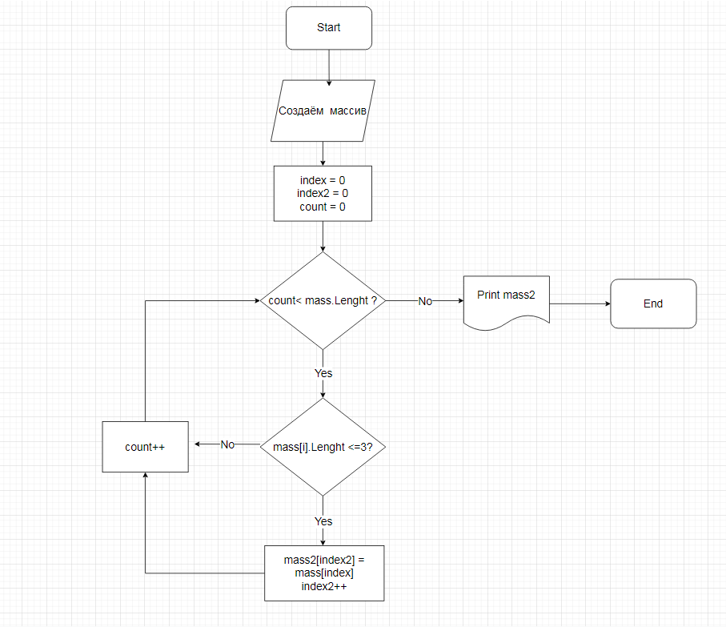

# Контрольная работа #

*Выполнил: Боровских Алина*

## Задача ##

Написать программу, которая из имеющегося массива строк формирует массив из строк, длина которых меньше или равна 3 символам. Первоначальный массив можно ввести с клавиатуры, либо задать на старте выполнения алгоритма.  При решении не рекомендуется пользоваться коллекциями,лучше обойтись исключительно массивами.

## Решение ##

1.	Создайте массив
2.	Введите размер (длину) массива
3.	Введите строку (элементы массива)
4.	Создать цикл, который считает длину введённых элементов в массиве
5.	Создать новый массив
6.	Создать цикл, который проверяет длину введённых элементов в массив. Если выполняется условие, то элемент записывается в новый массив.
7.	Напечатать массив с результатом

## Блок-схема ##

